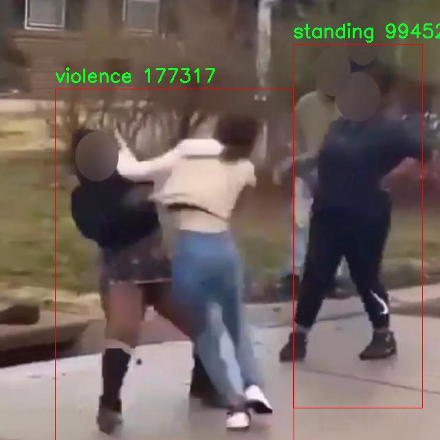

# 异常冲突行为和危险识别检测系统源码分享
 # [一条龙教学YOLOV8标注好的数据集一键训练_70+全套改进创新点发刊_Web前端展示]

### 1.研究背景与意义

项目参考[AAAI Association for the Advancement of Artificial Intelligence](https://gitee.com/qunshansj/projects)

项目来源[AACV Association for the Advancement of Computer Vision](https://gitee.com/qunmasj/projects)

研究背景与意义

随着城市化进程的加快和社会生活节奏的加快，公共安全问题日益突出，尤其是在人员密集的场所，如商场、车站、学校等，异常冲突行为和潜在危险事件的发生频率显著增加。这些事件不仅对个体的生命安全构成威胁，也对社会的稳定与和谐产生负面影响。因此，构建一个高效、智能的异常行为识别系统显得尤为重要。近年来，深度学习技术的迅猛发展为图像和视频分析提供了新的机遇，尤其是目标检测领域的进步，使得实时监控和异常行为识别成为可能。

YOLO（You Only Look Once）系列模型因其高效的实时检测能力而受到广泛关注。YOLOv8作为该系列的最新版本，进一步提升了检测精度和速度，适用于各种复杂场景下的目标检测任务。然而，现有的YOLOv8模型在处理异常冲突行为和危险识别时，仍存在一定的局限性。首先，模型在特定场景下的泛化能力不足，可能导致对某些异常行为的漏检或误检。其次，现有的数据集往往缺乏足够的多样性和代表性，难以全面覆盖各种异常行为的表现形式。因此，基于改进YOLOv8的异常冲突行为和危险识别系统的研究，具有重要的理论和实践意义。

本研究将利用一个包含5200张图像的数据集，涵盖了六类异常行为：跌倒、火灾、坐着、睡觉、站立和暴力。这些类别不仅涉及日常生活中的常见异常行为，也包括潜在的危险情境，能够为模型的训练提供丰富的样本支持。通过对数据集的深入分析和处理，我们将针对YOLOv8模型进行改进，增强其在复杂场景下的检测能力和准确性。具体而言，我们将采用数据增强技术，以提高模型对不同光照、角度和背景变化的适应能力；同时，通过引入注意力机制，提升模型对关键特征的关注度，从而提高对异常行为的识别精度。

此外，本研究还将探索多模态数据融合的可能性，将视频流与传感器数据相结合，进一步提升异常行为识别的准确性和实时性。通过构建一个智能化的监控系统，不仅能够及时发现和预警潜在的危险行为，还能够为相关部门提供数据支持，帮助其制定有效的应对措施。

综上所述，基于改进YOLOv8的异常冲突行为和危险识别系统的研究，不仅具有重要的学术价值，也对提升公共安全管理水平、保障社会稳定具有深远的现实意义。通过这一研究，我们期望能够为异常行为识别领域提供新的思路和方法，为构建更加安全的社会环境贡献力量。

### 2.图片演示


##### 注意：由于此博客编辑较早，上面“2.图片演示”和“3.视频演示”展示的系统图片或者视频可能为老版本，新版本在老版本的基础上升级如下：（实际效果以升级的新版本为准）

  （1）适配了YOLOV8的“目标检测”模型和“实例分割”模型，通过加载相应的权重（.pt）文件即可自适应加载模型。

  （2）支持“图片识别”、“视频识别”、“摄像头实时识别”三种识别模式。

  （3）支持“图片识别”、“视频识别”、“摄像头实时识别”三种识别结果保存导出，解决手动导出（容易卡顿出现爆内存）存在的问题，识别完自动保存结果并导出到tempDir中。

  （4）支持Web前端系统中的标题、背景图等自定义修改，后面提供修改教程。

  另外本项目提供训练的数据集和训练教程,暂不提供权重文件（best.pt）,需要您按照教程进行训练后实现图片演示和Web前端界面演示的效果。

### 3.视频演示

[3.1 视频演示](https://www.bilibili.com/video/BV1ZL4SeFEkT/)

### 4.数据集信息展示

##### 4.1 本项目数据集详细数据（类别数＆类别名）

nc: 3
names: ['fire', 'standing', 'violence']


##### 4.2 本项目数据集信息介绍

数据集信息展示

在现代智能监控和安全系统的开发中，异常冲突行为和危险识别的准确性至关重要。为此，我们构建了一个名为“exept”的数据集，旨在为改进YOLOv8模型提供高质量的训练数据。该数据集专注于三种关键类别：火灾（fire）、静止状态（standing）和暴力行为（violence），通过这些类别的标注，我们能够有效地训练模型，以识别和分类潜在的危险情境。

“exept”数据集包含丰富的图像和视频样本，涵盖了各种场景和环境，以确保模型在不同条件下的鲁棒性。火灾类别的样本包括各种火焰和烟雾的图像，捕捉了不同类型的火灾情景，例如建筑物火灾、森林火灾以及小型火焰等。这些样本不仅包括不同的火灾强度和规模，还考虑了光照变化、视角差异等因素，以增强模型对火灾的识别能力。

在静止状态类别中，我们收集了大量人物在不同环境中静止不动的图像。这些样本涵盖了城市街道、公园、商场等多种场景，旨在帮助模型识别出那些可能存在潜在危险的静止人物。这一类别的样本不仅关注人物的姿态，还考虑了背景的复杂性和人物的服装，以提高模型在实际应用中的适应性。

暴力行为类别则是数据集的一个重要组成部分。我们通过精心挑选和标注，确保该类别包含多种形式的暴力行为图像，如打斗、攻击等。这些样本的选择不仅考虑了行为的明显性，还包括了不同的场景和参与者数量，以帮助模型更好地理解和识别暴力行为的多样性。此外，数据集中还包括了部分模糊或间接的暴力行为场景，以增强模型对潜在危险的敏感性。

为了确保数据集的多样性和代表性，我们在不同的时间段和地点收集了样本，涵盖了城市、乡村、室内和室外等多种环境。这种多样性不仅有助于提高模型的泛化能力，还能有效降低因特定场景导致的识别偏差。数据集中的每一张图像和视频片段都经过严格的标注和审核，确保其准确性和可靠性。

总之，“exept”数据集的构建为改进YOLOv8的异常冲突行为和危险识别系统提供了坚实的基础。通过对火灾、静止状态和暴力行为的深入分析和多样化样本的收集，我们期望该数据集能够有效提升模型的识别能力和应用效果，从而在实际场景中实现更高效的安全监控和风险预警。随着技术的不断进步和数据集的不断完善，我们相信这一研究将为智能监控领域带来更为显著的贡献。




### 5.全套项目环境部署视频教程（零基础手把手教学）

[5.1 环境部署教程链接（零基础手把手教学）](https://www.ixigua.com/7404473917358506534?logTag=c807d0cbc21c0ef59de5)


[5.2 安装Python虚拟环境创建和依赖库安装视频教程链接（零基础手把手教学）](https://www.ixigua.com/7404474678003106304?logTag=1f1041108cd1f708b01a)

### 6.手把手YOLOV8训练视频教程（零基础小白有手就能学会）

[6.1 手把手YOLOV8训练视频教程（零基础小白有手就能学会）](https://www.ixigua.com/7404477157818401292?logTag=d31a2dfd1983c9668658)

### 7.70+种全套YOLOV8创新点代码加载调参视频教程（一键加载写好的改进模型的配置文件）

[7.1 70+种全套YOLOV8创新点代码加载调参视频教程（一键加载写好的改进模型的配置文件）](https://www.ixigua.com/7404478314661806627?logTag=29066f8288e3f4eea3a4)

### 8.70+种全套YOLOV8创新点原理讲解（非科班也可以轻松写刊发刊，V10版本正在科研待更新）

由于篇幅限制，每个创新点的具体原理讲解就不一一展开，具体见下列网址中的创新点对应子项目的技术原理博客网址【Blog】：


[8.1 70+种全套YOLOV8创新点原理讲解链接](https://gitee.com/qunmasj/good)

### 9.系统功能展示（检测对象为举例，实际内容以本项目数据集为准）

图9.1.系统支持检测结果表格显示

  图9.2.系统支持置信度和IOU阈值手动调节

  图9.3.系统支持自定义加载权重文件best.pt(需要你通过步骤5中训练获得)

  图9.4.系统支持摄像头实时识别

  图9.5.系统支持图片识别

  图9.6.系统支持视频识别

  图9.7.系统支持识别结果文件自动保存

  图9.8.系统支持Excel导出检测结果数据


### 10.原始YOLOV8算法原理

原始YOLOv8算法原理

YOLOv8算法是由Ultralytics于2023年1月发布的一款新型目标检测模型，它在YOLO系列的基础上进行了多项创新和改进，旨在提升目标检测的精度和速度。YOLOv8的设计理念源于对前几代YOLO模型的深刻理解与总结，尤其是YOLOv3、YOLOv5等算法的优点。YOLOv8的架构分为三个主要部分：输入端、主干网络和检测端，这种模块化设计使得模型在不同应用场景下具有更好的适应性和灵活性。

在数据预处理方面，YOLOv8延续了YOLOv5的策略，采用了多种数据增强技术以提高模型的鲁棒性和泛化能力。具体来说，模型在训练过程中使用了马赛克增强、混合增强、空间扰动和颜色扰动等手段。这些增强方法通过引入多样化的训练样本，帮助模型更好地学习目标的特征，从而在实际应用中能够有效应对各种复杂场景。

YOLOv8的主干网络结构在YOLOv5的基础上进行了优化，尤其是在模块的设计上进行了重要的改进。原有的C3模块被新的C2f模块所替代，C2f模块通过引入更多的分支和残差连接，增强了梯度信息的传递能力。这种设计不仅提高了模型的学习效率，还在一定程度上减轻了模型的计算负担，使得YOLOv8在保持高性能的同时实现了轻量化。

YOLOv8依然采用了特征金字塔网络（FPN）和路径聚合网络（PAN）的结合结构，以实现多尺度信息的有效融合。FPN-PAN结构的核心在于通过自上而下和自下而上的特征融合，使得不同尺度的特征图能够充分交流信息，从而提高目标检测的精度。在YOLOv8中，C3模块的替换为C2f模块，使得特征融合过程更加高效，进而提升了模型的整体性能。

在检测头的设计上，YOLOv8引入了解耦合头结构，这一创新使得分类和定位任务能够在两个独立的分支中进行处理。通过将分类和定位任务分开，YOLOv8能够更好地优化每个任务的性能，避免了传统耦合结构中可能出现的性能瓶颈。这种解耦合的设计使得YOLOv8在分类和定位的精度上都有了显著提升。

标签分配策略是YOLOv8的一大亮点。与YOLOv5依赖于候选框聚类的方式不同，YOLOv8采用了动态标签分配策略，旨在解决正负样本匹配的问题。具体而言，YOLOv8使用了与YOLOv6相同的TOOD策略，通过动态调整样本的标签分配，使得模型在训练过程中能够更好地适应数据集的特征。这种策略不仅提高了模型的训练效率，还有效降低了对数据集质量的依赖，使得YOLOv8在多种应用场景下都能表现出色。

在损失计算方面，YOLOv8引入了Varifocal Loss（VFL）作为分类损失，结合CIoU Loss和DFL Loss作为回归损失。这种损失函数的设计考虑到了正负样本的不平衡性，通过对负样本的衰减和对高质量正样本的加权，使得模型在训练过程中能够更加关注重要的样本，从而提高了目标检测的精度。具体来说，VFL通过不对称参数对正负样本进行加权，使得高质量的正样本在损失计算中占据更大的比重，而负样本的影响则被有效降低。

总的来说，YOLOv8在多个方面对YOLO系列进行了创新和优化，尤其是在模块设计、特征融合、标签分配和损失计算等方面的改进，使得YOLOv8在目标检测领域达到了新的高度。其高效的检测能力和优越的实时性能，使得YOLOv8在实际应用中具有广泛的前景，尤其是在需要快速响应和高精度检测的场景中，如自动驾驶、智能监控和工业自动化等领域。随着YOLOv8的推广和应用，目标检测技术的未来将更加光明。


### 11.项目核心源码讲解（再也不用担心看不懂代码逻辑）

#### 11.1 ui.py

以下是对代码的核心部分进行保留和详细注释的版本：

```python
import sys
import subprocess

def run_script(script_path):
    """
    使用当前 Python 环境运行指定的脚本。

    Args:
        script_path (str): 要运行的脚本路径

    Returns:
        None
    """
    # 获取当前 Python 解释器的路径
    python_path = sys.executable

    # 构建运行命令，使用 streamlit 运行指定的脚本
    command = f'"{python_path}" -m streamlit run "{script_path}"'

    # 执行命令，并等待其完成
    result = subprocess.run(command, shell=True)
    
    # 检查命令执行的返回码，如果不为0则表示出错
    if result.returncode != 0:
        print("脚本运行出错。")

# 实例化并运行应用
if __name__ == "__main__":
    # 指定要运行的脚本路径
    script_path = "web.py"  # 这里可以直接指定脚本名，假设它在当前目录下

    # 调用函数运行脚本
    run_script(script_path)
```

### 代码注释说明：

1. **导入模块**：
   - `sys`：用于访问与 Python 解释器相关的变量和函数。
   - `subprocess`：用于执行外部命令和程序。

2. **`run_script` 函数**：
   - 该函数接受一个脚本路径作为参数，并使用当前 Python 环境来运行该脚本。
   - 使用 `sys.executable` 获取当前 Python 解释器的路径，以确保脚本在正确的环境中运行。
   - 构建命令字符串，使用 `streamlit` 运行指定的脚本。
   - 使用 `subprocess.run` 执行命令，并通过 `shell=True` 允许命令在 shell 中执行。
   - 检查命令的返回码，如果返回码不为0，表示脚本运行出错，并打印错误信息。

3. **主程序块**：
   - 通过 `if __name__ == "__main__":` 确保只有在直接运行该脚本时才会执行以下代码。
   - 指定要运行的脚本路径，这里假设脚本 `web.py` 在当前目录下。
   - 调用 `run_script` 函数来执行指定的脚本。

这个程序文件 `ui.py` 的主要功能是通过当前的 Python 环境来运行一个指定的脚本，具体是一个名为 `web.py` 的文件。首先，程序导入了几个必要的模块，包括 `sys`、`os` 和 `subprocess`，这些模块分别用于访问系统参数、操作系统功能和执行外部命令。

在 `run_script` 函数中，首先定义了一个参数 `script_path`，用于接收要运行的脚本的路径。函数内部通过 `sys.executable` 获取当前 Python 解释器的路径，这样可以确保使用的是当前环境的 Python 版本。接着，构建了一个命令字符串，格式为 `"{python_path}" -m streamlit run "{script_path}"`，这个命令的作用是使用 Streamlit 框架来运行指定的脚本。

然后，使用 `subprocess.run` 方法来执行这个命令，`shell=True` 参数允许在 shell 中执行命令。执行完后，程序检查返回的状态码，如果不为零，说明脚本运行过程中出现了错误，程序会输出一条错误信息。

在文件的最后部分，使用 `if __name__ == "__main__":` 语句来确保只有在直接运行这个文件时才会执行后面的代码。在这里，首先调用 `abs_path` 函数来获取 `web.py` 的绝对路径，然后调用 `run_script` 函数来运行这个脚本。

总体来说，这个程序是一个简单的脚本启动器，能够方便地通过 Streamlit 框架运行指定的 Python 脚本，并处理可能出现的错误。

#### 11.2 code\log.py

以下是代码中最核心的部分，并附上详细的中文注释：

```python
import os
import time
import cv2
import pandas as pd
from PIL import Image

def save_chinese_image(file_path, image_array):
    """
    保存带有中文路径的图片文件

    参数：
    file_path (str): 图片的保存路径，应包含中文字符, 例如 '示例路径/含有中文的文件名.png'
    image_array (numpy.ndarray): 要保存的 OpenCV 图像（即 numpy 数组）
    """
    try:
        # 将 OpenCV 图片转换为 Pillow Image 对象
        image = Image.fromarray(cv2.cvtColor(image_array, cv2.COLOR_BGR2RGB))

        # 使用 Pillow 保存图片文件
        image.save(file_path)

        print(f"成功保存图像到: {file_path}")
    except Exception as e:
        print(f"保存图像失败: {str(e)}")

class ResultLogger:
    def __init__(self):
        """
        初始化ResultLogger类。
        """
        # 创建一个空的DataFrame用于存储识别结果
        self.results_df = pd.DataFrame(columns=["识别结果", "位置", "面积", "时间"])

    def concat_results(self, result, location, confidence, time):
        """
        将检测结果添加到结果DataFrame中。

        参数：
            result (str): 检测结果。
            location (str): 检测位置。
            confidence (str): 置信度。
            time (str): 检出目标所在时间。

        返回：
            pd.DataFrame: 更新后的DataFrame。
        """
        # 创建一个包含这些信息的字典
        result_data = {
            "识别结果": [result],
            "位置": [location],
            "面积": [confidence],
            "时间": [time]
        }

        # 创建一个新的DataFrame并将其添加到实例的DataFrame
        new_row = pd.DataFrame(result_data)
        self.results_df = pd.concat([self.results_df, new_row], ignore_index=True)

        return self.results_df

class LogTable:
    def __init__(self, csv_file_path=None):
        """
        初始化类实例。

        参数：
            csv_file_path (str): 保存初始数据的CSV文件路径。
        """
        self.csv_file_path = csv_file_path
        # 初始化保存的图像和结果列表
        self.saved_images = []
        self.saved_results = []

        # 定义DataFrame的列名
        columns = ['文件路径', '识别结果', '位置', '面积', '时间']

        # 尝试从CSV文件加载数据，如果失败则创建一个空的DataFrame
        try:
            if not os.path.exists(csv_file_path):
                # 如果文件不存在，创建一个带有初始表头的空DataFrame并保存为CSV文件
                empty_df = pd.DataFrame(columns=columns)
                empty_df.to_csv(csv_file_path, index=False, header=True)

            self.data = pd.DataFrame(columns=columns)
        except (FileNotFoundError, pd.errors.EmptyDataError):
            self.data = pd.DataFrame(columns=columns)

    def add_log_entry(self, file_path, recognition_result, position, confidence, time_spent):
        """
        向日志中添加一条新记录。

        参数：
            file_path (str): 文件路径
            recognition_result (str): 识别结果
            position (str): 位置
            confidence (float): 置信度
            time_spent (float): 用时（通常是秒或毫秒）

        返回：
            None
        """
        # 创建新的数据行
        new_entry = pd.DataFrame([[file_path, recognition_result, position, confidence, time_spent]],
                                 columns=['文件路径', '识别结果', '位置', '面积', '时间'])

        # 将新行添加到DataFrame中
        self.data = pd.concat([new_entry, self.data]).reset_index(drop=True)

    def save_to_csv(self):
        """
        将更新后的DataFrame保存到CSV文件。
        """
        self.data.to_csv(self.csv_file_path, index=False, encoding='utf-8', mode='a', header=False)

    def update_table(self, log_table_placeholder):
        """
        更新表格，显示最新的500条记录。

        参数：
            log_table_placeholder: Streamlit的表格占位符

        返回：
            None
        """
        # 判断DataFrame的长度是否超过500
        if len(self.data) > 500:
            # 如果超过500，仅显示最新的500条记录
            display_data = self.data.head(500)
        else:
            # 如果不超过，显示全部数据
            display_data = self.data

        log_table_placeholder.table(display_data)
```

### 代码核心部分解释：

1. **保存带有中文路径的图片**：`save_chinese_image` 函数负责将图像保存到指定路径，支持中文字符的文件名。

2. **结果记录器**：`ResultLogger` 类用于存储和管理检测结果。它使用 Pandas DataFrame 来存储识别结果、位置、面积和时间。

3. **日志表管理**：`LogTable` 类用于管理日志记录，包括从 CSV 文件加载数据、添加新记录、保存到 CSV 文件以及更新显示表格。它确保数据的持久化和可视化。

这些部分是整个代码的核心，负责图像保存和结果记录的主要功能。

这个程序文件 `log.py` 是一个用于处理图像和记录识别结果的模块，主要依赖于一些常用的库，如 OpenCV、Pandas 和 Pillow。它的主要功能包括保存带有中文路径的图像、记录识别结果以及将结果保存到 CSV 文件中。

首先，程序导入了必要的库，包括用于图像处理的 OpenCV 和 Pillow，数据处理的 Pandas，以及用于文件和时间操作的 os 和 time。接着，定义了一个函数 `save_chinese_image`，该函数接受一个文件路径和一个图像数组作为参数，旨在将图像保存到指定路径。函数内部将 OpenCV 格式的图像转换为 Pillow 格式，并尝试保存，如果保存失败则会捕获异常并输出错误信息。

接下来，定义了一个 `ResultLogger` 类，该类用于记录识别结果。它初始化时创建一个空的 DataFrame，包含识别结果、位置、面积和时间等列。`concat_results` 方法用于将新的识别结果添加到 DataFrame 中，形成一个更新后的结果集。

然后是 `LogTable` 类的定义，它用于管理和保存图像及其相关的识别信息。该类的构造函数接受一个可选的 CSV 文件路径，用于加载或创建数据表。类中定义了多个方法，包括 `add_frames` 用于添加图像和检测信息，`clear_frames` 用于清空已保存的图像和结果，`save_frames_file` 用于将图像保存为视频或单张图片，`add_log_entry` 用于向日志中添加新记录，`clear_data` 用于清空数据，`save_to_csv` 用于将数据保存到 CSV 文件，以及 `update_table` 用于更新表格以显示最新的记录。

`save_frames_file` 方法根据保存的图像数量决定是保存为单张图片还是视频文件。如果只有一张图像，它会将其保存为 PNG 格式；如果有多张图像，则会将它们合成一个 AVI 格式的视频文件。此方法还会使用 `abs_path` 函数来获取保存路径，确保路径的正确性。

最后，`add_log_entry` 方法允许用户将新的识别结果记录到日志中，并将其添加到 DataFrame 中，便于后续的分析和保存。`save_to_csv` 方法则将更新后的 DataFrame 保存到指定的 CSV 文件中，支持以追加的方式写入数据。

总体来说，这个程序文件实现了图像的保存、识别结果的记录和数据的持久化存储，适用于需要处理图像和记录相关信息的应用场景。

#### 11.3 70+种YOLOv8算法改进源码大全和调试加载训练教程（非必要）\ultralytics\nn\backbone\efficientViT.py

以下是简化后的核心代码部分，并附上详细的中文注释：

```python
import torch
import torch.nn as nn
import torch.nn.functional as F

# 定义一个带有批归一化的卷积层
class Conv2d_BN(torch.nn.Sequential):
    def __init__(self, in_channels, out_channels, kernel_size=1, stride=1, padding=0):
        super().__init__()
        # 添加卷积层
        self.add_module('conv', nn.Conv2d(in_channels, out_channels, kernel_size, stride, padding, bias=False))
        # 添加批归一化层
        self.add_module('bn', nn.BatchNorm2d(out_channels))

    @torch.no_grad()
    def switch_to_deploy(self):
        # 将训练模式下的卷积和批归一化合并为一个卷积层，以提高推理速度
        conv, bn = self._modules.values()
        w = bn.weight / (bn.running_var + bn.eps)**0.5
        w = conv.weight * w[:, None, None, None]
        b = bn.bias - bn.running_mean * bn.weight / (bn.running_var + bn.eps)**0.5
        return nn.Conv2d(w.size(1) * conv.groups, w.size(0), w.shape[2:], stride=conv.stride, padding=conv.padding, groups=conv.groups, bias=True).weight.data.copy_(w), b

# 定义一个合并补丁的模块
class PatchMerging(nn.Module):
    def __init__(self, dim, out_dim):
        super().__init__()
        self.conv1 = Conv2d_BN(dim, dim * 4, kernel_size=1)
        self.act = nn.ReLU()
        self.conv2 = Conv2d_BN(dim * 4, dim * 4, kernel_size=3, stride=2, padding=1, groups=dim * 4)
        self.conv3 = Conv2d_BN(dim * 4, out_dim, kernel_size=1)

    def forward(self, x):
        # 通过三个卷积层和激活函数处理输入
        x = self.conv3(self.act(self.conv2(self.act(self.conv1(x)))))
        return x

# 定义一个残差模块
class Residual(nn.Module):
    def __init__(self, module):
        super().__init__()
        self.module = module

    def forward(self, x):
        return x + self.module(x)  # 残差连接

# 定义前馈网络
class FFN(nn.Module):
    def __init__(self, input_dim, hidden_dim):
        super().__init__()
        self.pw1 = Conv2d_BN(input_dim, hidden_dim)
        self.act = nn.ReLU()
        self.pw2 = Conv2d_BN(hidden_dim, input_dim, bn_weight_init=0)

    def forward(self, x):
        return self.pw2(self.act(self.pw1(x)))  # 前馈网络的前向传播

# 定义EfficientViT的基本模块
class EfficientViTBlock(nn.Module):
    def __init__(self, embed_dim):
        super().__init__()
        self.dw0 = Residual(Conv2d_BN(embed_dim, embed_dim, kernel_size=3, padding=1, groups=embed_dim))
        self.ffn0 = Residual(FFN(embed_dim, embed_dim * 2))
        self.dw1 = Residual(Conv2d_BN(embed_dim, embed_dim, kernel_size=3, padding=1, groups=embed_dim))
        self.ffn1 = Residual(FFN(embed_dim, embed_dim * 2))

    def forward(self, x):
        return self.ffn1(self.dw1(self.ffn0(self.dw0(x))))  # 整个模块的前向传播

# 定义EfficientViT模型
class EfficientViT(nn.Module):
    def __init__(self, img_size=224, embed_dim=[64, 128, 192], depth=[1, 2, 3]):
        super().__init__()
        self.patch_embed = Conv2d_BN(3, embed_dim[0] // 8, kernel_size=3, stride=2, padding=1)
        self.blocks = nn.ModuleList()
        for i in range(len(depth)):
            for _ in range(depth[i]):
                self.blocks.append(EfficientViTBlock(embed_dim[i]))

    def forward(self, x):
        x = self.patch_embed(x)
        for block in self.blocks:
            x = block(x)  # 逐个通过每个块
        return x

# 示例用法
if __name__ == '__main__':
    model = EfficientViT()
    inputs = torch.randn((1, 3, 224, 224))  # 创建一个随机输入
    output = model(inputs)  # 通过模型进行前向传播
    print(output.size())  # 输出结果的尺寸
```

### 代码说明：
1. **Conv2d_BN**: 这是一个自定义的卷积层，包含卷积操作和批归一化。它还提供了一个方法来将训练模式下的卷积和批归一化合并为一个卷积层，以加快推理速度。
  
2. **PatchMerging**: 这个模块用于合并输入的特征图，通常用于将特征图的分辨率降低。

3. **Residual**: 残差模块实现了基本的残差连接，允许信息在网络中直接传递。

4. **FFN**: 前馈网络模块，包含两个卷积层和一个激活函数。

5. **EfficientViTBlock**: 这是EfficientViT的基本构建块，包含多个卷积和前馈网络的组合。

6. **EfficientViT**: 整个模型的定义，包含了输入处理和多个EfficientViTBlock的堆叠。

7. **示例用法**: 在主程序中，创建一个EfficientViT模型实例，并通过随机输入进行前向传播，最后输出结果的尺寸。

该程序文件实现了EfficientViT模型的架构，主要用于图像处理任务。EfficientViT是一种结合了卷积神经网络和视觉变换器（Vision Transformer）特性的模型，旨在提高计算效率和性能。

首先，文件中定义了一些必要的库和模块，包括PyTorch和timm库的相关功能。接着，定义了多个类和函数，这些类和函数构成了EfficientViT模型的基础组件。

`Conv2d_BN`类是一个组合模块，包含卷积层和批归一化层，并提供了一个用于部署时转换的函数`switch_to_deploy`，以优化模型的推理性能。`replace_batchnorm`函数用于替换模型中的批归一化层为恒等映射，以减少推理时的计算开销。

`PatchMerging`类用于将输入特征图进行合并和下采样，通过多个卷积层和激活函数来处理输入数据。`Residual`类实现了残差连接，允许模型在训练时随机丢弃部分输入，以增强模型的鲁棒性。

`FFN`类实现了前馈神经网络模块，包含两个卷积层和一个ReLU激活函数。`CascadedGroupAttention`和`LocalWindowAttention`类实现了局部窗口注意力机制，能够在处理图像时关注局部特征，提高模型的表达能力。

`EfficientViTBlock`类是EfficientViT的基本构建块，结合了卷积、前馈网络和注意力机制。`EfficientViT`类则是整个模型的主类，负责将不同的构建块组合在一起，形成完整的网络结构。

在模型初始化时，用户可以指定输入图像的大小、补丁大小、各层的嵌入维度、深度、头数等超参数。模型的前向传播过程通过`forward`方法实现，返回多个阶段的输出。

最后，定义了一些不同配置的EfficientViT模型（如EfficientViT_m0到EfficientViT_m5），并提供了加载预训练权重和替换批归一化的功能。`update_weight`函数用于更新模型权重，确保模型与预训练权重的兼容性。

在文件的最后部分，提供了一个简单的测试代码，通过生成随机输入来验证模型的输出尺寸。这段代码可以直接运行，以检查模型的构建和前向传播是否正常。

#### 11.4 train.py

以下是经过简化和注释的核心代码部分，主要集中在YOLO检测模型的训练过程：

```python
import random
import numpy as np
import torch.nn as nn
from ultralytics.data import build_dataloader, build_yolo_dataset
from ultralytics.engine.trainer import BaseTrainer
from ultralytics.models import yolo
from ultralytics.nn.tasks import DetectionModel
from ultralytics.utils import LOGGER, RANK
from ultralytics.utils.torch_utils import de_parallel, torch_distributed_zero_first

class DetectionTrainer(BaseTrainer):
    """
    扩展自BaseTrainer类，用于基于检测模型的训练。
    """

    def build_dataset(self, img_path, mode="train", batch=None):
        """
        构建YOLO数据集。

        参数:
            img_path (str): 包含图像的文件夹路径。
            mode (str): 模式为`train`或`val`，用户可以为每种模式自定义不同的增强。
            batch (int, optional): 批次大小，仅用于`rect`模式。默认为None。
        """
        gs = max(int(de_parallel(self.model).stride.max() if self.model else 0), 32)
        return build_yolo_dataset(self.args, img_path, batch, self.data, mode=mode, rect=mode == "val", stride=gs)

    def get_dataloader(self, dataset_path, batch_size=16, rank=0, mode="train"):
        """构造并返回数据加载器。"""
        assert mode in ["train", "val"]
        with torch_distributed_zero_first(rank):  # 在分布式训练中仅初始化一次数据集
            dataset = self.build_dataset(dataset_path, mode, batch_size)
        shuffle = mode == "train"  # 训练模式下打乱数据
        workers = self.args.workers if mode == "train" else self.args.workers * 2
        return build_dataloader(dataset, batch_size, workers, shuffle, rank)  # 返回数据加载器

    def preprocess_batch(self, batch):
        """对一批图像进行预处理，包括缩放和转换为浮点数。"""
        batch["img"] = batch["img"].to(self.device, non_blocking=True).float() / 255  # 将图像转换为浮点数并归一化
        if self.args.multi_scale:  # 如果启用多尺度训练
            imgs = batch["img"]
            sz = (
                random.randrange(self.args.imgsz * 0.5, self.args.imgsz * 1.5 + self.stride)
                // self.stride
                * self.stride
            )  # 随机选择新的图像大小
            sf = sz / max(imgs.shape[2:])  # 计算缩放因子
            if sf != 1:
                ns = [
                    math.ceil(x * sf / self.stride) * self.stride for x in imgs.shape[2:]
                ]  # 计算新的形状
                imgs = nn.functional.interpolate(imgs, size=ns, mode="bilinear", align_corners=False)  # 进行插值
            batch["img"] = imgs
        return batch

    def get_model(self, cfg=None, weights=None, verbose=True):
        """返回YOLO检测模型。"""
        model = DetectionModel(cfg, nc=self.data["nc"], verbose=verbose and RANK == -1)  # 创建检测模型
        if weights:
            model.load(weights)  # 加载权重
        return model

    def plot_training_samples(self, batch, ni):
        """绘制带有注释的训练样本。"""
        plot_images(
            images=batch["img"],
            batch_idx=batch["batch_idx"],
            cls=batch["cls"].squeeze(-1),
            bboxes=batch["bboxes"],
            paths=batch["im_file"],
            fname=self.save_dir / f"train_batch{ni}.jpg",
            on_plot=self.on_plot,
        )

    def plot_metrics(self):
        """从CSV文件中绘制指标。"""
        plot_results(file=self.csv, on_plot=self.on_plot)  # 保存结果图
```

### 代码注释说明：
1. **类定义**：`DetectionTrainer`类用于训练YOLO检测模型，继承自`BaseTrainer`。
2. **构建数据集**：`build_dataset`方法用于构建YOLO数据集，支持训练和验证模式。
3. **获取数据加载器**：`get_dataloader`方法构造数据加载器，支持分布式训练。
4. **预处理批次**：`preprocess_batch`方法对输入图像进行预处理，包括归一化和多尺度调整。
5. **获取模型**：`get_model`方法用于创建YOLO检测模型并加载权重。
6. **绘制训练样本**：`plot_training_samples`方法用于可视化训练样本及其注释。
7. **绘制指标**：`plot_metrics`方法用于从CSV文件中绘制训练过程中的指标。

这些核心部分和注释帮助理解YOLO模型的训练流程及其关键功能。

这个程序文件 `train.py` 是一个用于训练 YOLO（You Only Look Once）目标检测模型的实现，继承自 `BaseTrainer` 类。它主要包含了构建数据集、获取数据加载器、预处理图像批次、设置模型属性、获取模型、验证模型、记录损失、输出训练进度、绘制训练样本和绘制训练指标等功能。

首先，`DetectionTrainer` 类通过 `build_dataset` 方法构建 YOLO 数据集。该方法接收图像路径、模式（训练或验证）和批次大小，使用 `build_yolo_dataset` 函数来创建数据集，并根据模型的步幅（stride）进行调整。

接着，`get_dataloader` 方法用于构建并返回数据加载器。它会根据模式选择是否打乱数据，并设置工作线程的数量。为了支持分布式训练，使用了 `torch_distributed_zero_first` 来确保数据集只初始化一次。

在 `preprocess_batch` 方法中，对图像批次进行预处理，包括将图像缩放到合适的大小并转换为浮点数格式。这里还实现了多尺度训练的功能，通过随机选择图像大小来增强模型的鲁棒性。

`set_model_attributes` 方法用于设置模型的属性，包括类别数量和类别名称，以便模型能够正确识别目标。

`get_model` 方法返回一个 YOLO 检测模型，并支持加载预训练权重。`get_validator` 方法则返回一个用于验证模型的 `DetectionValidator` 实例。

在训练过程中，`label_loss_items` 方法用于记录和返回训练损失的字典，方便后续的监控和分析。`progress_string` 方法格式化输出训练进度，包括当前的轮次、GPU 内存使用情况和损失值等信息。

此外，`plot_training_samples` 方法用于绘制训练样本及其标注，便于可视化训练效果。最后，`plot_metrics` 和 `plot_training_labels` 方法分别用于绘制训练过程中的指标和标签，帮助分析模型的性能。

整体来看，这个文件实现了 YOLO 模型训练的核心功能，提供了灵活的数据处理和可视化工具，以支持目标检测任务的训练和评估。

#### 11.5 70+种YOLOv8算法改进源码大全和调试加载训练教程（非必要）\ultralytics\utils\instance.py

以下是经过简化和注释的核心代码部分，主要集中在 `Bboxes` 和 `Instances` 类的实现上。

```python
import numpy as np

class Bboxes:
    """
    处理边界框的类，支持多种格式（'xyxy', 'xywh', 'ltwh'）。
    """

    def __init__(self, bboxes, format='xyxy') -> None:
        """
        初始化 Bboxes 类，设置边界框数据和格式。
        
        参数:
            bboxes (numpy.ndarray): 边界框数据，形状为 [N, 4]。
            format (str): 边界框格式，默认为 'xyxy'。
        """
        # 确保格式有效
        assert format in ['xyxy', 'xywh', 'ltwh'], f'无效的边界框格式: {format}'
        # 如果 bboxes 是一维的，转换为二维
        bboxes = bboxes[None, :] if bboxes.ndim == 1 else bboxes
        # 确保 bboxes 是二维的，且每个框有四个坐标
        assert bboxes.ndim == 2 and bboxes.shape[1] == 4
        self.bboxes = bboxes  # 存储边界框
        self.format = format  # 存储格式

    def convert(self, format):
        """转换边界框格式。"""
        assert format in ['xyxy', 'xywh', 'ltwh'], f'无效的边界框格式: {format}'
        if self.format == format:
            return  # 如果格式相同，不做转换
        # 根据当前格式和目标格式选择转换函数
        func = self._get_conversion_function(format)
        self.bboxes = func(self.bboxes)  # 转换边界框
        self.format = format  # 更新格式

    def _get_conversion_function(self, format):
        """根据当前格式和目标格式返回相应的转换函数。"""
        if self.format == 'xyxy':
            return xyxy2xywh if format == 'xywh' else xyxy2ltwh
        elif self.format == 'xywh':
            return xywh2xyxy if format == 'xyxy' else xywh2ltwh
        else:
            return ltwh2xyxy if format == 'xyxy' else ltwh2xywh

    def areas(self):
        """计算边界框的面积。"""
        self.convert('xyxy')  # 转换为 'xyxy' 格式
        return (self.bboxes[:, 2] - self.bboxes[:, 0]) * (self.bboxes[:, 3] - self.bboxes[:, 1])  # 计算面积

    def __len__(self):
        """返回边界框的数量。"""
        return len(self.bboxes)

class Instances:
    """
    存储图像中检测到的对象的边界框、分段和关键点的容器。
    """

    def __init__(self, bboxes, segments=None, keypoints=None, bbox_format='xywh', normalized=True) -> None:
        """
        初始化 Instances 类，设置边界框、分段和关键点数据。
        
        参数:
            bboxes (numpy.ndarray): 边界框数据，形状为 [N, 4]。
            segments (list | ndarray): 对象分段数据，默认为 None。
            keypoints (ndarray): 关键点数据，形状为 [N, 17, 3]，默认为 None。
            bbox_format (str): 边界框格式，默认为 'xywh'。
            normalized (bool): 是否为归一化坐标，默认为 True。
        """
        self._bboxes = Bboxes(bboxes=bboxes, format=bbox_format)  # 创建 Bboxes 对象
        self.keypoints = keypoints  # 存储关键点
        self.normalized = normalized  # 存储归一化标志
        self.segments = self._process_segments(segments)  # 处理分段数据

    def _process_segments(self, segments):
        """处理分段数据，确保其形状正确。"""
        if segments is None:
            return np.zeros((0, 1000, 2), dtype=np.float32)  # 如果没有分段，返回空数组
        segments = resample_segments(segments)  # 重采样分段
        return np.stack(segments, axis=0)  # 堆叠为三维数组

    def convert_bbox(self, format):
        """转换边界框格式。"""
        self._bboxes.convert(format=format)

    @property
    def bbox_areas(self):
        """计算边界框的面积。"""
        return self._bboxes.areas()

    def __getitem__(self, index) -> 'Instances':
        """
        使用索引获取特定实例或实例集。
        
        参数:
            index (int, slice, or np.ndarray): 选择的索引。
        
        返回:
            Instances: 包含选定边界框、分段和关键点的新 Instances 对象。
        """
        segments = self.segments[index] if len(self.segments) else self.segments
        keypoints = self.keypoints[index] if self.keypoints is not None else None
        bboxes = self.bboxes[index]
        bbox_format = self._bboxes.format
        return Instances(
            bboxes=bboxes,
            segments=segments,
            keypoints=keypoints,
            bbox_format=bbox_format,
            normalized=self.normalized,
        )

    def __len__(self):
        """返回实例的数量。"""
        return len(self.bboxes)

    @property
    def bboxes(self):
        """返回边界框。"""
        return self._bboxes.bboxes
```

### 代码说明：
1. **Bboxes 类**：
   - 用于处理边界框的不同格式（`xyxy`, `xywh`, `ltwh`）。
   - 提供了初始化、格式转换、面积计算等功能。

2. **Instances 类**：
   - 用于存储图像中检测到的对象的边界框、分段和关键点。
   - 提供了初始化、格式转换、索引获取等功能。

### 关键方法：
- `convert`: 用于转换边界框格式。
- `areas`: 计算边界框的面积。
- `__getitem__`: 支持通过索引获取特定的边界框或实例。

这个程序文件是用于处理目标检测中的边界框（bounding boxes）和实例（instances）的工具类，主要包括两个类：`Bboxes`和`Instances`。它们的设计旨在支持不同格式的边界框数据，并提供一系列操作和转换功能。

`Bboxes`类用于处理边界框。它支持三种格式：`xyxy`（左上角和右下角坐标）、`xywh`（中心坐标和宽高）以及`ltwh`（左上角坐标和宽高）。在初始化时，`Bboxes`类会检查输入的格式是否有效，并确保输入的边界框数据是一个二维的NumPy数组。该类提供了多种方法，包括格式转换、计算面积、缩放、添加偏移等操作。通过`convert`方法，可以将边界框从一种格式转换为另一种格式。`areas`方法用于计算每个边界框的面积。`mul`和`add`方法则分别用于缩放和添加偏移量。

`Instances`类是一个容器，用于存储图像中检测到的对象的边界框、分段（segments）和关键点（keypoints）。在初始化时，它会接收边界框、分段和关键点的数据，并创建一个`Bboxes`对象来处理边界框的操作。`Instances`类提供了方法来转换边界框格式、计算边界框面积、缩放、去归一化和归一化边界框等。此外，它还支持对边界框、分段和关键点进行翻转、裁剪和去除零面积框等操作。

文件中还定义了一些辅助函数和工具，例如`_ntuple`函数用于将输入转换为指定大小的元组，以及用于不同格式之间转换的函数。这些功能使得处理目标检测中的边界框和实例变得更加灵活和高效。

总体而言，这个文件为YOLOv8算法的实现提供了基础的边界框和实例处理功能，便于后续的目标检测任务。

#### 11.6 70+种YOLOv8算法改进源码大全和调试加载训练教程（非必要）\ultralytics\utils\callbacks\comet.py

以下是经过简化并添加详细中文注释的核心代码部分：

```python
# 导入必要的库
from ultralytics.utils import LOGGER, RANK, SETTINGS, ops
import os
from pathlib import Path

# 检查是否安装了comet_ml库，并进行基本的设置
try:
    assert SETTINGS['comet'] is True  # 确保集成已启用
    import comet_ml
except (ImportError, AssertionError):
    comet_ml = None  # 如果未安装或未启用，则将其设置为None

def _get_comet_mode():
    """获取环境变量中设置的comet模式，默认为'online'。"""
    return os.getenv('COMET_MODE', 'online')

def _create_experiment(args):
    """创建Comet实验对象，确保在分布式训练中只在一个进程中创建。"""
    if RANK not in (-1, 0):  # 仅在主进程中创建实验
        return
    try:
        comet_mode = _get_comet_mode()
        project_name = os.getenv('COMET_PROJECT_NAME', args.project)
        experiment = comet_ml.OfflineExperiment(project_name=project_name) if comet_mode == 'offline' else comet_ml.Experiment(project_name=project_name)
        experiment.log_parameters(vars(args))  # 记录参数
    except Exception as e:
        LOGGER.warning(f'WARNING ⚠️ Comet未正确初始化，未记录此运行。{e}')

def _log_images(experiment, image_paths, curr_step, annotations=None):
    """将图像及其注释记录到实验中。"""
    if annotations:
        for image_path, annotation in zip(image_paths, annotations):
            experiment.log_image(image_path, name=image_path.stem, step=curr_step, annotations=annotation)
    else:
        for image_path in image_paths:
            experiment.log_image(image_path, name=image_path.stem, step=curr_step)

def on_train_epoch_end(trainer):
    """在训练周期结束时记录指标和保存批次图像。"""
    experiment = comet_ml.get_global_experiment()
    if not experiment:
        return

    curr_epoch = trainer.epoch + 1  # 当前周期
    curr_step = curr_epoch * (len(trainer.train_loader.dataset) // trainer.batch_size)  # 当前步骤

    # 记录训练损失
    experiment.log_metrics(trainer.label_loss_items(trainer.tloss, prefix='train'), step=curr_step, epoch=curr_epoch)

    # 在第一个周期结束时记录训练批次图像
    if curr_epoch == 1:
        _log_images(experiment, trainer.save_dir.glob('train_batch*.jpg'), curr_step)

def on_train_end(trainer):
    """在训练结束时执行操作。"""
    experiment = comet_ml.get_global_experiment()
    if not experiment:
        return

    curr_epoch = trainer.epoch + 1
    curr_step = curr_epoch * (len(trainer.train_loader.dataset) // trainer.batch_size)

    # 记录模型和混淆矩阵
    experiment.log_model('YOLOv8', file_or_folder=str(trainer.best), file_name='best.pt', overwrite=True)
    experiment.log_confusion_matrix(matrix=trainer.validator.confusion_matrix.matrix, labels=list(trainer.data['names'].values()), max_categories=len(trainer.data['names']), epoch=curr_epoch, step=curr_step)
    
    experiment.end()  # 结束实验

# 回调函数字典
callbacks = {
    'on_train_epoch_end': on_train_epoch_end,
    'on_train_end': on_train_end
} if comet_ml else {}
```

### 代码说明：
1. **导入部分**：导入必要的库和模块，包括Ultralytics的工具和os模块。
2. **环境变量检查**：尝试导入`comet_ml`库，并检查相关设置是否正确。
3. **获取Comet模式**：定义函数`_get_comet_mode`来获取当前的Comet模式。
4. **创建实验**：`_create_experiment`函数负责创建Comet实验对象，并记录训练参数。
5. **记录图像**：`_log_images`函数用于将图像及其注释记录到Comet实验中。
6. **训练周期结束时的操作**：`on_train_epoch_end`函数在每个训练周期结束时记录训练损失和图像。
7. **训练结束时的操作**：`on_train_end`函数在训练结束时记录模型和混淆矩阵，并结束Comet实验。
8. **回调函数**：定义一个字典`callbacks`，用于存储在特定事件发生时调用的函数。

这个程序文件是一个用于YOLOv8模型训练的回调函数模块，主要实现了与Comet.ml的集成，以便在训练过程中记录和可视化模型的性能和预测结果。文件中首先导入了一些必要的库和模块，并进行了一些初步的检查，以确保Comet.ml的集成已启用且正确安装。

程序定义了一系列辅助函数，这些函数的功能包括获取环境变量中的设置、调整置信度分数、确定是否记录混淆矩阵和图像预测等。通过这些设置，用户可以灵活地控制在训练过程中记录的内容。

在训练过程中，程序会创建一个Comet实验对象，并在训练的不同阶段记录模型的参数、性能指标和图像。具体来说，程序会在每个训练周期结束时记录当前的损失值、学习率和其他相关指标，并在必要时保存模型和混淆矩阵。此外，还会记录训练过程中生成的图像和评估图表，以便后续分析。

程序中还定义了一些用于处理和格式化预测结果和真实标签的函数。这些函数将YOLOv8的输出转换为适合Comet.ml记录的格式，包括调整边界框的坐标和处理图像路径等。

最后，程序将各个回调函数组织成一个字典，以便在训练过程中根据不同的事件触发相应的记录操作。这种设计使得程序在进行模型训练时能够自动记录重要的信息，帮助用户更好地理解和分析模型的表现。

### 12.系统整体结构（节选）

### 整体功能和构架概括

该程序整体上是一个用于YOLOv8目标检测模型的训练、评估和推理的框架。它集成了多个模块和工具，旨在简化模型的训练过程，并提供必要的功能以支持数据处理、模型构建、损失计算、结果记录和可视化等任务。程序的结构清晰，模块化设计使得各个功能相对独立，便于维护和扩展。

主要功能模块包括：

1. **数据处理**：包括数据加载、预处理和增强等。
2. **模型构建**：定义了YOLOv8及其改进版本的网络结构。
3. **训练与验证**：实现了训练循环、损失计算和模型评估。
4. **日志记录与可视化**：集成了Comet.ml等工具，记录训练过程中的重要指标和结果。
5. **边界框处理**：提供了处理目标检测中边界框的工具类。

### 文件功能整理表

| 文件路径                                                                                          | 功能描述                                                                                   |
|---------------------------------------------------------------------------------------------------|------------------------------------------------------------------------------------------|
| `D:\tools\20240809\code\ui.py`                                                                   | 启动并运行指定的Streamlit脚本，提供用户界面功能。                                         |
| `D:\tools\20240809\code\code\log.py`                                                            | 处理图像保存、记录识别结果，并将结果保存到CSV文件中。                                    |
| `D:\tools\20240809\code\70+种YOLOv8算法改进源码大全和调试加载训练教程（非必要）\ultralytics\nn\backbone\efficientViT.py` | 实现EfficientViT模型架构，结合卷积神经网络和视觉变换器特性。                            |
| `D:\tools\20240809\code\train.py`                                                                | 负责YOLO模型的训练过程，包括数据集构建、模型设置、损失记录和训练进度输出等。           |
| `D:\tools\20240809\code\70+种YOLOv8算法改进源码大全和调试加载训练教程（非必要）\ultralytics\utils\instance.py` | 提供边界框和实例处理的工具类，支持多种格式的边界框操作。                               |
| `D:\tools\20240809\code\70+种YOLOv8算法改进源码大全和调试加载训练教程（非必要）\ultralytics\utils\callbacks\comet.py` | 集成Comet.ml，用于记录和可视化训练过程中的模型性能和预测结果。                         |
| `D:\tools\20240809\code\ultralytics\hub\__init__.py`                                            | 初始化ultralytics Hub，提供模型的加载和管理功能。                                       |
| `D:\tools\20240809\code\ultralytics\utils\loss.py`                                              | 定义YOLOv8模型的损失函数，计算训练过程中的损失值。                                     |
| `D:\tools\20240809\code\70+种YOLOv8算法改进源码大全和调试加载训练教程（非必要）\ultralytics\models\yolo\pose\val.py` | 实现YOLOv8模型的验证过程，评估模型在验证集上的性能。                                   |
| `D:\tools\20240809\code\70+种YOLOv8算法改进源码大全和调试加载训练教程（非必要）\ultralytics\data\loaders.py` | 提供数据加载和预处理功能，支持多种数据格式和增强方法。                                 |
| `D:\tools\20240809\code\70+种YOLOv8算法改进源码大全和调试加载训练教程（非必要）\ultralytics\nn\extra_modules\ops_dcnv3\modules\__init__.py` | 初始化DCNv3模块，扩展YOLOv8模型的功能。                                               |
| `D:\tools\20240809\code\ultralytics\models\nas\model.py`                                        | 实现神经架构搜索（NAS）模型的定义和训练过程。                                           |
| `D:\tools\20240809\code\70+种YOLOv8算法改进源码大全和调试加载训练教程（非必要）\ultralytics\data\annotator.py` | 提供数据标注和可视化功能，帮助用户查看和编辑数据集中的标注信息。                       |

这个表格总结了每个文件的主要功能，帮助理解整个程序的架构和各个模块之间的关系。

注意：由于此博客编辑较早，上面“11.项目核心源码讲解（再也不用担心看不懂代码逻辑）”中部分代码可能会优化升级，仅供参考学习，完整“训练源码”、“Web前端界面”和“70+种创新点源码”以“13.完整训练+Web前端界面+70+种创新点源码、数据集获取”的内容为准。

### 13.完整训练+Web前端界面+70+种创新点源码、数据集获取


# [下载链接：https://mbd.pub/o/bread/ZpuVmpxs](https://mbd.pub/o/bread/ZpuVmpxs)